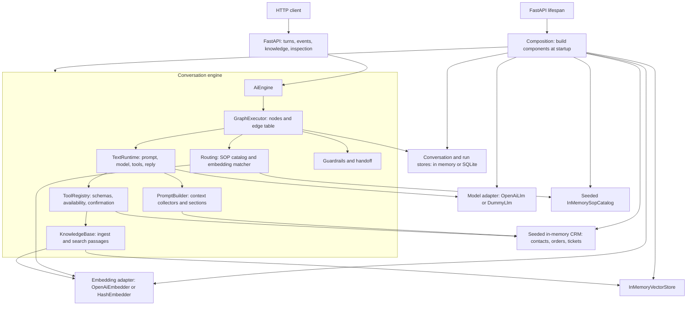
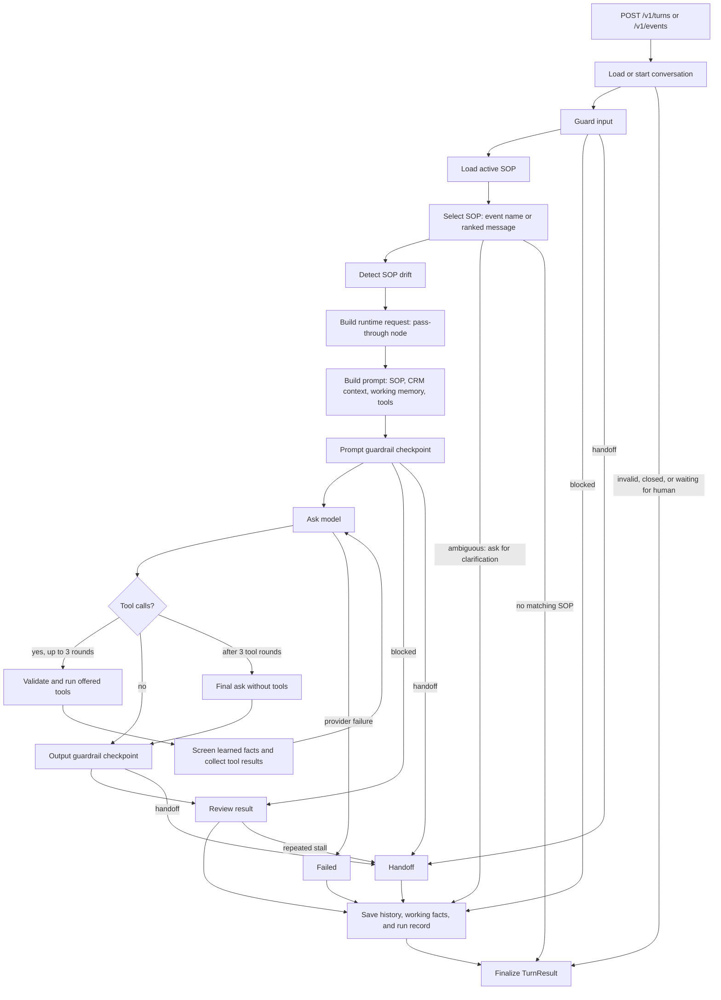
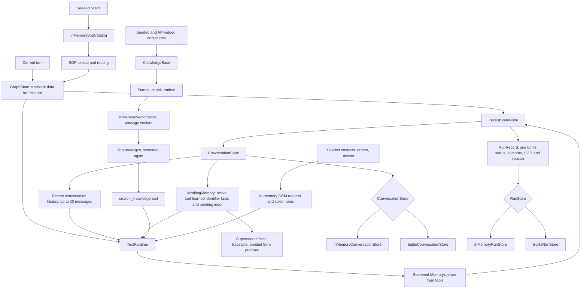

# Architecture

These diagrams show the code wired by
[`build()`](../src/agentic_kit/composition.py). Arrows show startup wiring,
request flow, or data exchange as labeled; each section names its current
implementation.

## 1. Components and adapters

`ports/` defines the interfaces between the engine and adapters. The model
and embedder switch together when a real `OPENAI_API_KEY` is configured.
`SQLITE_PATH` switches only the conversation and run stores.

## 2. One turn through the graph

Both a customer message and a named event enter the same graph. An event
selects the SOP that declares its name; a customer message is ranked against
SOP descriptions and examples. The graph's
[`EDGES`](../src/agentic_kit/engine/graph/edges.py) table owns the branches.

The runtime offers six tools: `track_order`, `lookup_ticket`,
`lookup_contact`, `add_ticket_note`, `search_knowledge`, and
`finish_procedure`. The registry checks arguments and requires confirmation
for write tools. Tool results can contribute identifier facts to working
memory; those facts are committed when the turn is persisted. The default
guardrail profile enforces input, memory, and knowledge checks; prompt checks
are disabled and output checks observe only. The guarded branches shown above
are available when a profile enables them.

## 3. Memory, knowledge, and persistence

`ConversationState` holds recent dialogue, the active SOP, and `WorkingMemory`.
Only tools write working facts; current order and ticket data is read from CRM
again rather than cached as facts. `RunRecord` is an audit summary of a turn,
not a transcript. SQLite can retain conversations and run records across
restarts. The vector index, SOP catalog, and sample CRM remain in memory and
are recreated on startup. The knowledge base is a reference document search
facility, not a persistent customer memory store.
